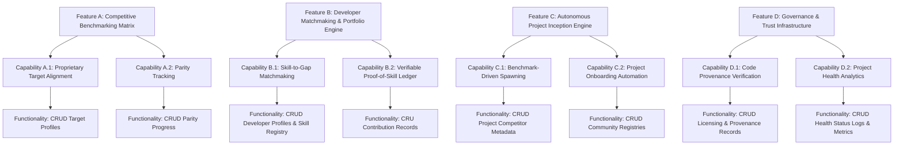

# Project Mirror - Master Overview

"Project Mirror" must be analyzed not merely as another open-source repository directory or project aggregator, but as an infrastructure-level intervention designed to solve the structural "contribution barriers," talent underutilization, and proprietary lock-in plaguing the modern technology landscape.

Here is the MECE categorical breakdown of "Project Mirror's" architectural framework, isolating its market mechanics and system design.

---

## 1. Value Proposition Narrative
The architectural alignment of "Project Mirror's" core mission and positioning.

### I. Core Value Creation
*   **Product-Market Fit**: The contemporary tech sector suffers from extreme volatility, rendering entry into established corporate products and traditional technical roles increasingly exclusive and difficult to navigate. This creates a profound mismatch between elite, unutilized developer talent and static software development ecosystems. "Project Mirror" achieves direct product-market fit by acting as a dynamic matchmaking and generation engine. It decouples engineering contribution from traditional corporate gatekeeping, transforming fragmented developer aspirations into structured, open-source alternatives to existing proprietary services.
*   **Customer Demand**: There is an escalating demand from global developers, engineers, and digital architects to find high-signal, frictionless paths to build meaningful software, establish verifiable proof of skill, and escape volatile employment cycles. Users require a systematic framework to identify where open-source gaps exist. "Project Mirror" captures this demand by giving talent a clear directive: either reinforce an active open-source project or initiate an alternative to an incumbent proprietary service.
*   **Competitive Differentiation**: Standard code repositories and developer platforms function as passive code-hosting utilities or isolated project lists, requiring manual, high-friction discovery to map open software to market needs. "Project Mirror" differentiates by being structurally competitive and comparative. It inherently maps the global software landscape by positioning open-source projects as direct alternatives or direct counterweights to specific proprietary offerings, providing instant contextual clarity regarding where developer labor is most critically required.

### II. Go-to-Market Execution
*   **Marketing & Awareness**: The narrative centers around "democratizing market innovation." Marketing focus is heavily weighted toward relieving the friction of codebase discovery for engineers, while showcasing an actionable blueprint for open-source project leads looking to mobilize global talent against proprietary monopolies.
*   **Sales & Distribution**: "Project Mirror" distributes to autonomous developers as a verifiable portfolio vehicle and contribution portal (B2C), while positioning itself to open-source organizations, project leads, and foundations as a systemic pipeline for high-fidelity talent acquisition and project acceleration (B2B2C).
*   **Onboarding & Implementation**: The platform is engineered to register authenticated developers into verified global causes with minimal friction. The core onboarding experience fast-tracks users into two distinct operational flows: committing to an existing open alternative, or mapping a new proprietary benchmark to spawn a brand-new open-source project, immediately updating the platform's global index.

### III. Customer Experience
*   **Quality & Reliability**: Because the application serves as a comprehensive registry tracking global software alternatives and live contributor commitments, low-latency state updates, precise project categorization, and rock-solid developer authentication protocols form its baseline foundation.
*   **Ease of Use**: The architecture prioritizes rapid ecosystem deployment. It eliminates the traditional, intimidating overhead of navigating obscure codebases without market context. By condensing developer options into simple actions—Join Community, Join Project, or Spawn Competitor—the interface lowers the operational barrier to entry, translating developer intent into active contribution instantly.
*   **Support & Services**: For active contributors and project leads, support is realized through comprehensive system dashboards. These interfaces track the development velocity, feature parity, and overall growth metrics of open-source alternatives against their target proprietary benchmarks.

### IV. Loyalty & Engagement
*   **Switching Costs**: Once an engineer establishes a verifiable, compound contribution history within this centralized matrix, and project leads depend on its systemic talent pipeline, migrating to an isolated, flat directory incurs a prohibitive loss of professional equity, community trust, and operational velocity.
*   **Network Effects**: As more authenticated users engage with "Project Mirror," the platform's comprehensive registry of the world’s open-source projects expands exponentially. Every new project spawned or alternative registered scales the overall discovery surface area, attracting a denser pool of contributors and multiplying the collective utility of the entire ecosystem.

---

## 2. G.E.M.S.G. Stakes at Play
The systemic macro-stakes (Governance, Economics, Modernization, Sociology, Growth) of transforming software contributions and open-source democratization.

```
┌─────────────────────────────────────────────────────────────┐
│                    THE G.E.M.S.G. STAKES                    │
├───────────────┬─────────────────────────────────────────────┤
│ Governance    │ Code provenance, licensing, & project trust │
├───────────────┼─────────────────────────────────────────────┤
│ Economics     │ Unlocking unutilized engineering labor equity│
├───────────────┼─────────────────────────────────────────────┤
│ Modernization │ Shifting from siloed repos to a market graph│
├───────────────┼─────────────────────────────────────────────┤
│ Sociology     │ Decentralizing software ownership & access  │
├───────────────┼─────────────────────────────────────────────┤
│ Growth        │ Compounding a global alternative tech stack │
└─────────────────────────────────────────────────────────────┘
```

### I. Core Value Creation
*   **Product-Market Fit (The Modernization Stake)**: The historical model of uncoordinated, siloed open-source development is structurally inefficient. "Project Mirror" addresses the Modernization stake by replacing fragmented exploration with a structured, market-aligned index where open projects are explicitly defined by their relationship to existing industry solutions.
*   **Customer Demand (The Economic Stake)**: Macroeconomic instability has commoditized traditional tech roles, leaving vast pools of elite engineering talent underutilized. "Project Mirror" addresses the Economic stake by unlocking a structured mechanism for developers to invest their labor directly into alternative digital infrastructure, transforming unutilized time into global software utility.
*   **Competitive Differentiation (The Sociological Stake)**: Rather than allowing proprietary corporations to dictate technological gatekeeping and access costs, "Project Mirror" addresses the Sociological stake by democratizing the capability to build equivalents. It provides the collective architecture required to systematically challenge software monopolies through open, community-driven development.

### II. Go-to-Market Execution
*   **Sales & Distribution (The Governance Stake)**: As software supply chains, license integrity, and project stewardship face unprecedented scrutiny, "Project Mirror" positions itself as a transparent governance framework. By tracking explicit developer commitments and project origins, it establishes a reliable infrastructure for distributed project ownership and contribution ethics.

### III. Customer Experience
*   **Ease of Use (The Sociological Stake)**: The platform democratizes systemic software engineering mobilization. If an interface requires extensive navigation through fragmented ecosystems just to find a codebase in need of support, it fails the broader talent pool. The application honors developer availability immediately, converting raw human capability into a global contribution standard.

### IV. Loyalty & Engagement
*   **Network Effects (The Growth Stake)**: The global developer economy represents an indispensable pillar of modern infrastructure. "Project Mirror" scales by compounding independent project creations into a unified, multi-directional web of open-source alternatives. This network unlocks non-linear growth paths, where every added project expands the search, deployment, and contribution surface area for the entire technical ecosystem.

---

## 3. User Segments Using the App
The micro-level personas interacting with the interface, categorized by their distinct psychological drivers and operational needs.

```
             ┌────────────────────────────────────────┐
             │            PROJECT MIRROR              │
             │           ECOSYSTEM ENGINE             │
             └───────────────────┬────────────────────┘
                                 │
         ┌───────────────────────┼───────────────────────┐
         ▼                       ▼                       ▼
   ┌───────────┐           ┌───────────┐           ┌───────────┐
   │CONTRIBUTOR│           │ PROJECT   │           │ ECOSYSTEM │
   │ Portfolio │           │   LEADS   │           │ STEWARDS  │
   │ Validation│           │ Resource  │           │ Parity &  │
   └───────────┘           │ Mobilization          │ Longevity │
                           └───────────┘           └───────────┘
```

### Open-Source Contributors (Engineers, Designers, Architects)
*   **Core Driver**: Securing meaningful project alignment, building immutable proof-of-skill portfolios, and executing impactful code contributions without navigating traditional industry gatekeepers.
*   **Value Mapping (Ease of Use)**: They require high-signal alignment and rapid project integration. "Project Mirror" serves them by providing instantaneous access to active projects or new opportunities, matching their precise skill set to real-world software gaps.

### New Open-Source Project Leads (The Innovators)
*   **Core Driver**: Validating a clear market need for an open alternative, crowdsourcing high-caliber technical talent, and establishing a visible competitor blueprint against existing proprietary services.
*   **Value Mapping (Product-Market Fit)**: They require immediate ecosystem exposure and structural validation. The platform enables them to register their initiative directly against a proprietary benchmark, instantly elevating their visibility to a global community of ready volunteers.

### Ecosystem Stewards & Maintainers (Established OSS Products)
*   **Core Driver**: Expanding project longevity, tracking feature parity against corporate iterations, and maintaining a constant stream of verified contributor inputs to secure software health.
*   **Value Mapping (Competitive Differentiation)**: They utilize the platform as a persistent talent acquisition layer. It allows them to position their mature frameworks as ready alternatives to volatile proprietary options, ensuring a resilient operational roadmap.

---

## 4. Fundamental Market Forces
The systemic macro-pressures driving adoption and commercial validation.

### I. Core Value Creation
*   **The Tech Market Volatility Inflection Point (Product-Market Fit)**: Widespread workforce restructuring and corporate gatekeeping have left massive talent pools seeking alternative avenues to exercise capability. This shift drives an active demand vector for open, sovereign contribution networks. "Project Mirror" captures this shift, providing an intentional framework for autonomous production.
*   **The Sovereign Software Maturity (Customer Demand)**: The market demands transparency, data security, and self-hosted software resilience as proprietary costs escalate and services face instability. "Project Mirror" satisfies this reality by turning decentralized collaboration into a systematic pipeline for producing robust, open alternatives.

### II. Go-to-Market Execution
*   **The Onboarding Fragmentation Squeeze (Sales & Distribution)**: The open-source landscape is heavily fractured across disparate hosting platforms, chat rooms, and undocumented codebases. The market demands an expressive middleware that can unify these opportunities. "Project Mirror" steps into this void, serving as an interactive registry for active talent and distributed project architectures.

### III. Customer Experience
*   **Frictionless Contribution Expectations (Ease of Use)**: Modern developers judge platforms by how rapidly they can move from interest to active production. Systems that require tedious manual alignment slow momentum. "Project Mirror" capitalizes on the market pressure for responsive developer tools by making project entry and competitive creation intuitive and instantaneous.

### IV. Loyalty & Engagement
*   **The Shift Toward Alternative Software Ecosystems (Switching Costs)**: The industry is transitioning away from unquestioned proprietary reliance toward collaborative, resilient open ecosystems. By organizing development around market-indexed alternatives, "Project Mirror" builds a highly resilient repository for global code contributions, positioning itself as a durable utility for tracking open technology.

---

## Systemic Takeaway
"Project Mirror" wins the marketplace by transforming fragmented open-source contribution into a highly structured, market-aligned ecosystem for software generation. It rebalances the tech landscape's information architecture: giving talented individuals their opportunity back, giving project leads a responsive workspace to scale, and giving global software an enduring framework where open alternatives are enriched and accelerated by their explicit relationship to the market.

---

## 5. Product Requirements & Hierarchy

Based on this master overview, the system architecture is broken down into a three-tier taxonomy:
1.  **Broad Features**: Strategic capabilities mapped to long-horizon business objectives (e.g., Growth, Engagement, Retention).
2.  **Capabilities**: High-level system actions that orchestrate multiple atomic operations and guide user direction.
3.  **Functionality**: Low-level database operations (Create, Read, Update, Delete, Archive, Purge) that support capabilities.

---

### 5.1 Hierarchy Overview



---

### 5.2 Detailed Breakdown

#### Feature A: Competitive Benchmarking Matrix
*   **Strategic Objective**: Increased User Engagement & Competitive Differentiation. Maps open-source projects directly as alternatives to proprietary software to provide immediate context for developer effort.
*   **Capabilities**:
    *   **Capability A.1: Proprietary Target Alignment**: Maps the global software landscape by associating proprietary benchmarks to open-source alternatives.
    *   **Capability A.2: Parity Tracking**: Monitioring and displaying development parity (features, performance, scaling) between open-source alternatives and target proprietary platforms.
*   **Functionality**:
    *   `CREATE` Proprietary software profiles and benchmarking criteria.
    *   `READ` Benchmarking matrix data and feature checklist comparisons.
    *   `UPDATE` Feature parity statuses (e.g., "In Progress", "Completed").
    *   `DELETE` Incorrectly mapped target associations.
    *   `ARCHIVE` Outdated benchmarking profiles for retired/defunct proprietary software.

#### Feature B: Developer Matchmaking & Portfolio Engine
*   **Strategic Objective**: Increased Quantitative Growth (unlocking unutilized developer labor equity) & High switching costs.
*   **Capabilities**:
    *   **Capability B.1: Skill-to-Gap Matchmaking**: Decoupling contribution barriers by automatically surfacing high-signal codebase gaps that align with the user's specific skill sets.
    *   **Capability B.2: Verifiable Proof-of-Skill Ledger**: Accumulating a verifiable history of developer contributions to serve as a portfolio vector.
*   **Functionality**:
    *   `CREATE` Contributor profile and register skill sets.
    *   `READ` Matchmaking recommendations and open issue lists.
    *   `UPDATE` Contributor profiles, skills, and active commitments.
    *   `DELETE` Cancelled/revoked active commitments.
    *   `ARCHIVE` Completed contributions into historical proof-of-work achievements.

#### Feature C: Autonomous Project Inception Engine (Spawn System)
*   **Strategic Objective**: Exponential Network Effects & Compound Growth (expanding the search and deployment surface area of open alternatives).
*   **Capabilities**:
    *   **Capability C.1: Benchmark-Driven Spawning**: Allowing users to instantiate new open-source initiatives directly targeted at challenging a specific proprietary monopoly.
    *   **Capability C.2: Project Onboarding Automation**: Minimizing onboarding friction for new projects by standardizing initial templates, roadmaps, and community links.
*   **Functionality**:
    *   `CREATE` Brand new open-source alternative projects mapped to a benchmark.
    *   `READ` Spawn templates, repository templates, and licensing guidelines.
    *   `UPDATE` Project metadata, repository links, and initial roadmaps.
    *   `DELETE` Spurned or spam project records.
    *   `PURGE` Permanently delete projects flagged as malicious or containing severe licensing violations.

#### Feature D: Governance & Trust Infrastructure
*   **Strategic Objective**: Increased Governance & Security Integrity (securing the software supply chain and license validation).
*   **Capabilities**:
    *   **Capability D.1: Code Provenance Verification**: Tracking the integrity of code contributions, contributor license agreements (CLAs), and project origins.
    *   **Capability D.2: Project Health Analytics**: Compiling dashboard analytics indicating developer velocity, community growth, and overall project health.
*   **Functionality**:
    *   `CREATE` Contribution logs, CLA approvals, and governance rules.
    *   `READ` Repository health reports, license histories, and contributor density statistics.
    *   `UPDATE` Repository activity metrics and trust ratings.
    *   `ARCHIVE` Inactive or unmaintained projects into read-only reference states.

---

### 5.3 Layman's Breakdown

*A simplified, non-technical explanation of the Project Mirror product hierarchy:*

#### Feature A: Competitive Benchmarking Matrix
*   **Feature**: *The Big Tech Matchup Board* - A comparison dashboard that lists popular paid software and shows how well open-source alternatives stack up against them.
*   **Capabilities**: *Matching Competitors & Tracking Feature Progress* - The system's ability to pair an open-source project directly to the paid tool it replaces, and measure how close the open alternative is to copying all of the paid tool's key features.
*   **Functionality**: *Managing the Parity Data* - The actual buttons and database actions that allow users to add a new paid software profile, read the comparison checklists, check off completed features, or delete mistakes.

#### Feature B: Developer Matchmaking & Portfolio Engine
*   **Feature**: *The Developer Matchmaker & Resume Builder* - A hub that matches developers' skills with the projects that need them most, while building a verifiable resume of their work.
*   **Capabilities**: *Finding Code Gaps & Recording Proof of Skill* - The system's ability to analyze a developer's skills and automatically suggest the exact code tasks they can solve, and generate a secure, un-fakeable history of every contribution they make.
*   **Functionality**: *Managing Profiles and Contributions* - The technical operations to create developer accounts, read matching recommendations, update active work status, and save completed work to a portfolio.

#### Feature C: Autonomous Project Inception Engine
*   **Feature**: *The "Spawn a Competitor" Launchpad* - A startup wizard that makes it fast and easy to launch a brand new open-source alternative to an existing paid tool.
*   **Capabilities**: *Initiating a Project & Auto-Setting Up the Community* - The system's ability to bootstrap a project from scratch, automatically setting up standard folders, open-source licenses, roadmaps, and community guidelines.
*   **Functionality**: *Creating and Wiping Projects* - The backend actions to register a new project alternative, edit its settings, archive inactive starts, or permanently delete (purge) spam or copycat project records.

#### Feature D: Governance & Trust Infrastructure
*   **Feature**: *Project Safety, Legality, & Pulse Monitoring* - The quality-control and security system that keeps projects legally clean, secure, and active.
*   **Capabilities**: *Verifying Code Origins & Measuring Project Health* - The ability to check who wrote incoming code (avoiding copy-paste legal problems) and analyze whether a project is highly active or slowly dying.
*   **Functionality**: *Storing Safety Rules and Activity Logs* - The database operations to save contributor sign-offs, read activity metrics, update the project's health rating, and archive old logs.
